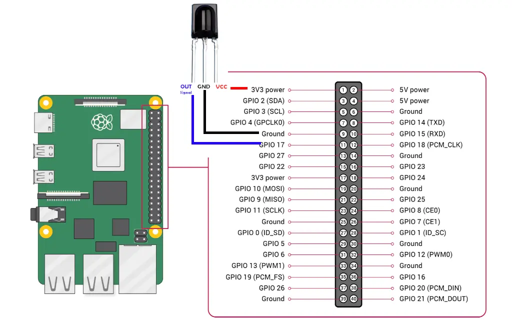
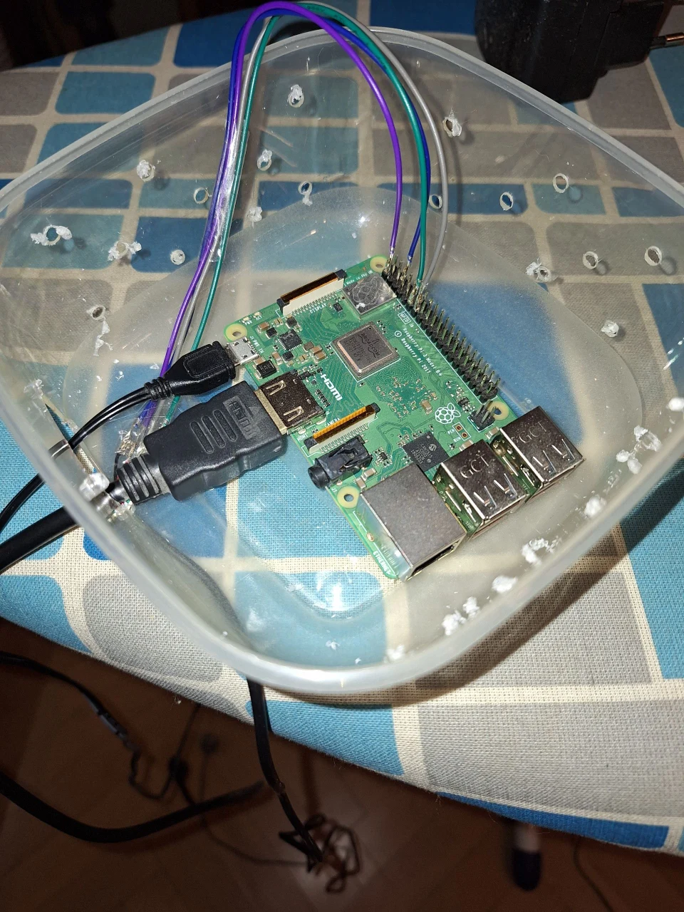
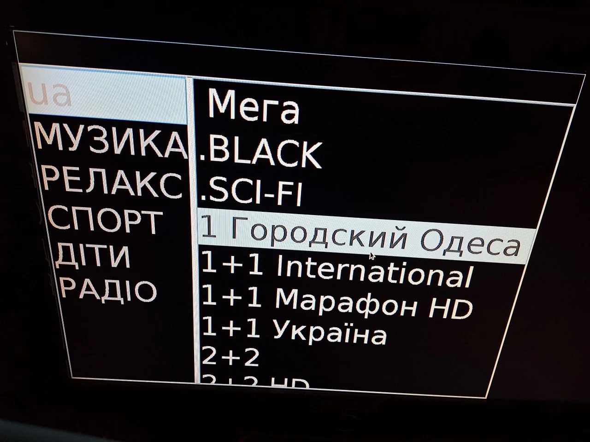

# mptv
MPV front-end for IPTV channels.

Convert Your Raspberry Pi into IPTV receiver. Anything that MPV can play.

## Stack

Java Swing application that crawls and parses M3U playlists, displaying them in graphical menu and opening them with MPV.
Reads IR commands from any TV remote, controlling menu, opening and managing MPV player state.

Example configuration ```config.json.example```, rename to ```config.json```. Take look and configure the way You like it. May have multiple IR bind sets, so You can switch between them with ```currentBindSet``` variable. Use ```piir dump``` to dump IR commands from Your TV remote.

Uses [PiIR](https://github.com/ts1/PiIR) for reading TV remote IR signals.

```pigpio``` must be present in system, and its daemon ```pigpiod``` must be running. Enable it with ```sudo systemctl enable pigpiod```

Recommended to use Xorg and PulseAudio. PulseAudio default sink must be set to HDMI output, with command like ```pactl set-default-sink 1```

Don't forget to enable PulseAudio user service with command ```systemctl --user enable pulseaudio```

Some configurations files could be found in ```linux``` folder to help with Your setup.

## Configuration
The configuration is a JSON file ```config.json```

- ```frame``` - GUI window parameters. Note that ```fullscreen``` may not work well in Xorg.
- ```db``` - DB configuration. Only supports SQLite.
- ```piir``` - PiIR configuration. You must provide path to piir executable in ```exec``` field. ```gpio``` corresponds to GPIO pin.
```bindSet``` decribes binds for each remote, select current remote bind set with ```currentBindSet``` field. For bind explanation refer to ```config.json.example```
- ```sources``` - Here You write Your M3U playlist sources. May be either local file or remote URL. Take look at ```config.json.example```
- ```tasks``` - Adjust here intervals for each task to be executed. If You experience frequent MPV restarts, You may want to adjust ```processService``` to 2 second interval. ```crawler``` task will be executed once every 24 hours. 

### Recommended IR connection to GPIO


## Photos



